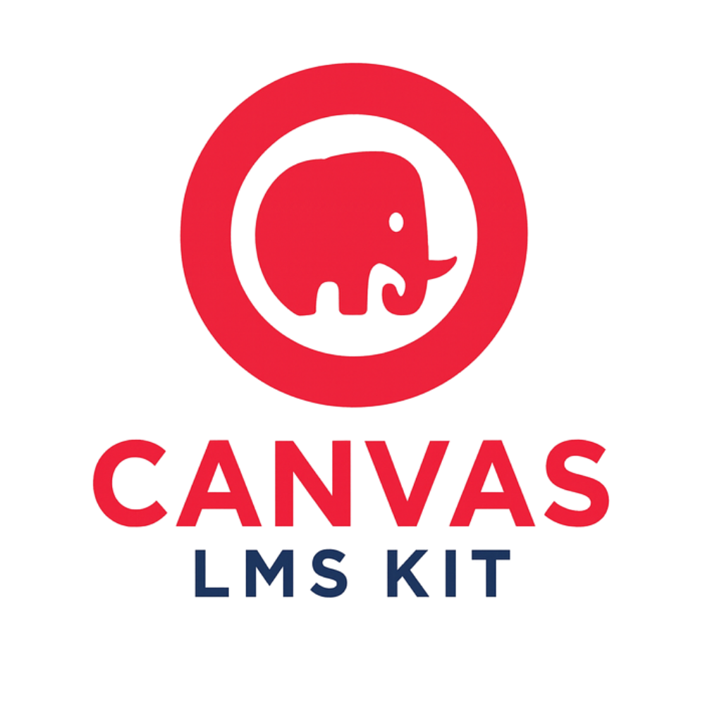

<div align="center">
  
  
  # Canvas LMS Kit
  
  [](https://packagist.org/packages/jjuanrivvera/canvas-lms-kit)
  [](https://packagist.org/packages/jjuanrivvera/canvas-lms-kit)
  [](https://github.com/jjuanrivvera/canvas-lms-kit/actions/workflows/ci.yml)
  [](https://php.net)
  [](https://github.com/jjuanrivvera/canvas-lms-kit/blob/main/LICENSE)

  **The most comprehensive PHP SDK for Canvas LMS API. Production-ready with 40+ APIs implemented.**
</div>

---

## ✨ Why Canvas LMS Kit?

- 🚀 **Production Ready**: Rate limiting, middleware support, battle-tested
- 📚 **Comprehensive**: 37 Canvas APIs fully implemented
- 🛡️ **Type Safe**: Full PHP 8.1+ type declarations and PHPStan level 6
- 🔧 **Developer Friendly**: Intuitive Active Record pattern - just pass arrays!
- 📖 **Well Documented**: Extensive examples, guides, and API reference
- ⚡ **Performance**: Built-in pagination, caching support, and optimized queries

## 🎯 Quick Start

```php
use CanvasLMS\Config;
use CanvasLMS\Api\Courses\Course;

Config::setApiKey('your-api-key');
Config::setBaseUrl('https://canvas.instructure.com');

// It's that simple!
$courses = Course::fetchAll();
foreach ($courses as $course) {
    echo $course->name . "\n";
}
```

## 📑 Table of Contents

- [Requirements](#-requirements)
- [Installation](#-installation)
- [Configuration](#-configuration)
- [Usage Examples](#-usage-examples)
- [Supported APIs](#-supported-apis)
- [Advanced Features](#-advanced-features)
- [Testing](#-testing)
- [Contributing](#-contributing)
- [Support](#-support)

## 📋 Requirements

- PHP 8.1 or higher
- Composer
- Canvas LMS API token
- Extensions: `json`, `curl`, `mbstring`

## 📦 Installation

```bash
composer require jjuanrivvera/canvas-lms-kit
```

## ⚙️ Configuration

```php
use CanvasLMS\Config;

// Basic configuration
Config::setApiKey('your-api-key');
Config::setBaseUrl('https://canvas.instructure.com');

// Optional: Set account ID for scoped operations
Config::setAccountId(1);

// Optional: Configure middleware
Config::setMiddleware([
    'retry' => ['max_attempts' => 3],
    'rate_limit' => ['wait_on_limit' => true],
]);
```

## 💡 Usage Examples

### Working with Courses

```php
use CanvasLMS\Api\Courses\Course;

// List courses (first page with Canvas default limit)
$courses = Course::fetchAll();

// Get ALL courses across all pages
$allCourses = Course::fetchAllPages();

// Find a specific course
$course = Course::find(123);

// Create a new course - just pass an array!
$course = Course::create([
    'name' => 'Introduction to PHP',
    'course_code' => 'PHP101',
    'start_at' => '2025-02-01T00:00:00Z'
]);

// Update a course
$course->update([
    'name' => 'Advanced PHP Programming'
]);

// Save changes with fluent interface support
$course->name = 'Updated Course Name';
$course->save()->enrollments(); // Save and immediately get enrollments

// Delete a course (also returns self for chaining)
$course->delete();
```

### Managing Assignments

```php
use CanvasLMS\Api\Assignments\Assignment;

// Create an assignment - simple array syntax
$assignment = Assignment::create([
    'course_id' => 123,
    'name' => 'Final Project',
    'description' => 'Build a web application',
    'points_possible' => 100,
    'due_at' => '2025-03-15T23:59:59Z',
    'submission_types' => ['online_upload', 'online_url']
]);

// Grade submissions
$submission = $assignment->getSubmission($studentId);
$submission->grade([
    'posted_grade' => 95,
    'comment' => 'Excellent work!'
]);
```

### Working with Modules and Module Items

```php
use CanvasLMS\Api\Modules\Module;
use CanvasLMS\Api\Modules\ModuleItem;

// Get course and set context
$course = Course::find(123);
Module::setCourse($course);

// Create a module
$module = Module::create([
    'name' => 'Week 1: Introduction',
    'position' => 1,
    'published' => true
]);

// Add items to the module (requires both course and module context)
ModuleItem::setCourse($course);
ModuleItem::setModule($module);

// Add an assignment to the module
$item = ModuleItem::create([
    'title' => 'Week 1 Assignment',
    'type' => 'Assignment',
    'content_id' => $assignment->id,
    'position' => 1,
    'completion_requirement' => [
        'type' => 'must_submit'
    ]
]);

// Or use the course instance method (recommended)
$modules = $course->modules();
```

### Working with Current User

```php
use CanvasLMS\Api\Users\User;

// Get current authenticated user instance
$currentUser = User::self();

// Canvas supports 'self' for these endpoints:
$profile = $currentUser->getProfile();
$activityStream = $currentUser->getActivityStream();
// Note: getTodo() method coming soon in next release
$groups = $currentUser->groups();

// Other methods require explicit user ID
$user = User::find(123);
$enrollments = $user->enrollments();
$courses = $user->courses();
```

### Managing Groups

```php
use CanvasLMS\Api\Groups\Group;
use CanvasLMS\Api\Groups\GroupMembership;

// Create a group in your account
$group = Group::create([
    'name' => 'Study Group Alpha',
    'description' => 'Weekly study sessions',
    'is_public' => false,
    'join_level' => 'invitation_only'
]);

// Add members to the group
$membership = $group->createMembership([
    'user_id' => 456,
    'workflow_state' => 'accepted'
]);

// Get group activity stream
$activities = $group->activityStream();

// Invite users by email
$group->invite(['student1@example.com', 'student2@example.com']);
```

### File Uploads

```php
use CanvasLMS\Api\Files\File;

// Upload a file to a course
$file = File::upload([
    'course_id' => 123,
    'file_path' => '/path/to/document.pdf',
    'name' => 'Course Syllabus.pdf',
    'parent_folder_path' => 'course_documents'
]);
```

### Feature Flags

```php
use CanvasLMS\Api\FeatureFlags\FeatureFlag;
use CanvasLMS\Api\Courses\Course;

// List all feature flags for the account
$flags = FeatureFlag::fetchAll();

// Get a specific feature flag
$flag = FeatureFlag::find('new_gradebook');

// Enable a feature for the account
$flag->enable();

// Disable a feature
$flag->disable();

// Feature flags for a specific course
$course = Course::find(123);
$courseFlags = $course->featureFlags();

// Enable a feature for a specific course
$courseFlag = $course->getFeatureFlag('anonymous_marking');
$courseFlag->enable();
```

### Working with Multi-Context Resources

Some Canvas resources exist in multiple contexts (Account, Course, User, Group). Canvas LMS Kit follows an **Account-as-Default** convention for consistency:

```php
use CanvasLMS\Api\Rubrics\Rubric;
use CanvasLMS\Api\ExternalTools\ExternalTool;
use CanvasLMS\Api\CalendarEvents\CalendarEvent;
use CanvasLMS\Api\Files\File;

// Direct calls default to Account context
$rubrics = Rubric::fetchAll();           // Account-level rubrics
$tools = ExternalTool::fetchAll();       // Account-level external tools  
$events = CalendarEvent::fetchAll();     // Account-level calendar events
$files = File::fetchAll();               // Exception: User files (no account context)

// Course-specific access through Course instance
$course = Course::find(123);
$courseRubrics = $course->rubrics();            // Course-specific rubrics
$courseTools = $course->externalTools();        // Course-specific tools
$courseEvents = $course->calendarEvents();      // Course-specific events
$courseFiles = $course->files();                // Course-specific files

// Direct context access when needed
$userEvents = CalendarEvent::fetchByContext('user', 456);
$groupFiles = File::fetchByContext('groups', 789);
```

**Multi-Context Resources:**
- **Rubrics** (Account/Course)
- **External Tools** (Account/Course)
- **Calendar Events** (Account/Course/User/Group)
- **Files** (User/Course/Group) - No Account context
- **Groups** (Account/Course/User)
- **Content Migrations** (Account/Course/Group/User)

### Working with Course-Scoped Resources

Some Canvas resources are strictly course-scoped and require setting the course context before use:

```php
use CanvasLMS\Api\Pages\Page;
use CanvasLMS\Api\Quizzes\Quiz;
use CanvasLMS\Api\Modules\Module;
use CanvasLMS\Api\DiscussionTopics\DiscussionTopic;
use CanvasLMS\Api\Courses\Course;

// Get your course
$course = Course::find(123);

// Option 1: Set context for each API (required for direct API calls)
Page::setCourse($course);
Quiz::setCourse($course);
Module::setCourse($course);
DiscussionTopic::setCourse($course);

// Now you can use the APIs directly
$pages = Page::fetchAll();
$quizzes = Quiz::fetchAll();
$modules = Module::fetchAll();
$discussions = DiscussionTopic::fetchAll();

// Option 2: Use course instance methods (recommended - no context setup needed)
$pages = $course->pages();
$quizzes = $course->quizzes();
$modules = $course->modules();
$discussions = $course->discussionTopics();
```

**Important:** These APIs will throw an exception if you try to use them without setting the course context first.

### Learning Outcomes

```php
use CanvasLMS\Api\Outcomes\Outcome;
use CanvasLMS\Api\OutcomeGroups\OutcomeGroup;

// Create an outcome group
$group = OutcomeGroup::create([
    'title' => 'Critical Thinking Skills',
    'description' => 'Core competencies for analytical thinking'
]);

// Create a learning outcome
$outcome = Outcome::create([
    'title' => 'Analyze Complex Problems',
    'description' => 'Student can break down complex problems into manageable parts',
    'mastery_points' => 3,
    'ratings' => [
        ['description' => 'Exceeds', 'points' => 4],
        ['description' => 'Mastery', 'points' => 3],
        ['description' => 'Near Mastery', 'points' => 2],
        ['description' => 'Below Mastery', 'points' => 1]
    ]
]);

// Link outcome to a group
$group->linkOutcome($outcome->id);

// Align outcome with an assignment
$assignment = Assignment::find(123);
$assignment->alignOutcome($outcome->id, [
    'mastery_score' => 3,
    'possible_score' => 4
]);
```

### Content Migrations

```php
use CanvasLMS\Api\Courses\Course;
use CanvasLMS\Api\ContentMigrations\ContentMigration;

// Copy content between courses
$course = Course::find(456);
$migration = $course->copyContentFrom(123, [
    'except' => ['announcements', 'calendar_events']
]);

// Selective copy with specific items
$migration = $course->selectiveCopyFrom(123, [
    'assignments' => [1, 2, 3],
    'quizzes' => ['quiz-1', 'quiz-2'],
    'modules' => [10, 11]
]);

// Import a Common Cartridge file
$migration = $course->importCommonCartridge('/path/to/course.imscc');

// Copy with date shifting
$migration = $course->copyWithDateShift(123, '2024-01-01', '2025-01-01', [
    'shift_dates' => true,
    'old_start_date' => '2024-01-01',
    'new_start_date' => '2025-01-01'
]);

// Track migration progress
while (!$migration->isCompleted()) {
    $progress = $migration->getProgress();
    echo "Migration {$progress->workflow_state}: {$progress->completion}%\n";
    sleep(5);
    $migration->refresh();
}

// Handle migration issues
$issues = $migration->migrationIssues();
foreach ($issues as $issue) {
    if ($issue->workflow_state === 'active') {
        $issue->resolve();
    }
}
```

## 📊 Supported APIs

### ✅ Currently Implemented (37 APIs)

<details>
<summary><b>📚 Core Course Management</b></summary>

- ✅ **Courses** - Full CRUD operations
- ✅ **Modules** - Content organization
- ✅ **Module Items** - Individual content items
- ✅ **Sections** - Course sections
- ✅ **Tabs** - Navigation customization
- ✅ **Pages** - Wiki-style content
</details>

<details>
<summary><b>👥 Users & Enrollment</b></summary>

- ✅ **Users** - User management with self() pattern support
- ✅ **Enrollments** - Course enrollments
- ✅ **Admins** - Administrative roles
- ✅ **Accounts** - Account management
</details>

<details>
<summary><b>📝 Assessment & Grading</b></summary>

- ✅ **Assignments** - Assignment management
- ✅ **Quizzes** - Quiz creation and management
- ✅ **Quiz Submissions** - Student attempts
- ✅ **Submissions** - Assignment submissions
- ✅ **Submission Comments** - Feedback
- ✅ **Rubrics** - Grading criteria and assessment
- ✅ **Rubric Associations** - Link rubrics to assignments
- ✅ **Rubric Assessments** - Grade with rubrics
- ✅ **Outcomes** - Learning objectives and competencies
- ✅ **Outcome Groups** - Organize learning outcomes
- ✅ **Outcome Imports** - Import outcome data
- ✅ **Outcome Results** - Track student achievement
</details>

<details>
<summary><b>💬 Communication & Collaboration</b></summary>

- ✅ **Discussion Topics** - Forums and discussions
- ✅ **Groups** - Student groups and collaboration
- ✅ **Group Categories** - Organize and manage groups
- ✅ **Group Memberships** - Group member management
- 🔄 **Announcements** - Course announcements (coming soon)
- 🔄 **Conversations** - Private messaging (coming soon)
</details>

<details>
<summary><b>🔧 Tools & Integration</b></summary>

- ✅ **Files** - File management and uploads
- ✅ **External Tools** - LTI integrations
- ✅ **Module Assignment Overrides** - Custom dates
- ✅ **Calendar Events** - Event management
- ✅ **Appointment Groups** - Scheduling
- ✅ **Progress** - Async operation tracking
- ✅ **Content Migrations** - Import/export course content
- ✅ **Migration Issues** - Handle import problems
- ✅ **Feature Flags** - Manage Canvas feature toggles
</details>

## 🚀 Advanced Features

### Production-Ready Middleware

```php
// The SDK automatically handles rate limiting and retries
$course = Course::find(123); // Protected by middleware

// Canvas API Rate Limiting (3000 requests/hour)
// ✅ Automatic throttling when approaching limits
// ✅ Smart backoff strategies
// ✅ Transparent to your application
```

### Multi-Tenant Support

```php
// Manage multiple Canvas instances
Config::setContext('production');
$prodCourse = Course::find(123);

Config::setContext('test');
$testCourse = Course::find(456);
```

### Pagination Support

```php
// Get first page with Canvas default limit
$courses = Course::fetchAll(); 

// Get ALL items across all pages automatically
$allCourses = Course::fetchAllPages();

// Manual pagination control
$paginator = Course::fetchAllPaginated(['per_page' => 50]);
foreach ($paginator as $page) {
    foreach ($page as $course) {
        // Process each course
    }
}
```

### Fluent Interface & Method Chaining

All `save()` and `delete()` methods return the instance, enabling method chaining:

```php
// Save and continue working with the object
$course->name = 'New Name';
$enrollments = $course->save()->enrollments();

// Chain multiple operations
$assignment = new Assignment();
$assignment->name = 'Final Project';
$assignment->points_possible = 100;
$submissions = $assignment->save()->getSubmissions();

// Error handling with fluent interface
try {
    $user->email = 'new@example.com';
    $user->save()->enrollments(); // Save and get enrollments
} catch (CanvasApiException $e) {
    // Handle error - no more silent failures!
}
```

### Relationship Methods

```php
// Efficient relationship loading
$course = Course::find(123);
$students = $course->getStudents();
$assignments = $course->getAssignments();
$modules = $course->getModules();
```

### Context Management (Account-as-Default)

Canvas LMS Kit uses the **Account-as-Default** convention for multi-context resources:

```php
// Direct API calls use Account context (Config::getAccountId())
$groups = Group::fetchAll();              // First page of groups in the account
$rubrics = Rubric::fetchAll();            // First page of rubrics in the account
$migrations = ContentMigration::fetchAll(); // First page of migrations in the account

// Course-specific access via Course instance methods
$course = Course::find(123);
$courseGroups = $course->getGroups();              // Groups in this course
$courseRubrics = $course->getRubrics();            // Rubrics in this course
$courseMigrations = $course->contentMigrations(); // Migrations in this course

// User-specific access via User instance methods
$user = User::find(456);
$userGroups = $user->groups();                    // User's groups
$userMigrations = $user->contentMigrations();    // User's migrations

// Group-specific access via Group instance methods
$group = Group::find(789);
$groupMigrations = $group->contentMigrations();  // Group's migrations
```

**Why Account-as-Default?**
- ✅ Consistency across all multi-context resources
- ✅ Respects Canvas hierarchy (Account → Course → User/Group)
- ✅ Clean separation of concerns
- ✅ No confusion about which context is being used

[📖 Full Context Management Guide](https://github.com/jjuanrivvera/canvas-lms-kit/wiki/Context-Management-Guide)

## 🧪 Testing

```bash
# Using Docker (recommended)
docker compose exec php composer test
docker compose exec php composer check  # Run all checks

# Local development
composer test
composer cs-fix   # Fix coding standards
composer phpstan  # Static analysis
```

## 🤝 Contributing

We welcome contributions! Please see our [Contributing Guidelines](CONTRIBUTING.md).

### Quick Contribution Guide

1. Fork the repository
2. Create your feature branch (`git checkout -b feature/amazing-feature`)
3. Write tests for your changes
4. Ensure all tests pass (`composer check`)
5. Commit your changes (`git commit -m 'Add amazing feature'`)
6. Push to the branch (`git push origin feature/amazing-feature`)
7. Open a Pull Request

## 📄 License

This project is licensed under the MIT License - see the [LICENSE](LICENSE) file for details.

## 💬 Support

<table>
<tr>
<td align="center">
<a href="https://github.com/jjuanrivvera/canvas-lms-kit/issues/new?assignees=&labels=bug&template=bug_report.yml">

</a>
</td>
<td align="center">
<a href="https://github.com/jjuanrivvera/canvas-lms-kit/issues/new?assignees=&labels=enhancement&template=feature_request.yml">

</a>
</td>
<td align="center">
<a href="https://github.com/jjuanrivvera/canvas-lms-kit/discussions">

</a>
</td>
</tr>
</table>

### Resources

- 📚 **[Wiki Documentation](https://github.com/jjuanrivvera/canvas-lms-kit/wiki)** - Comprehensive guides
- 🔍 **[API Reference](https://jjuanrivvera.github.io/canvas-lms-kit/)** - Detailed API docs
- 💬 **[GitHub Discussions](https://github.com/jjuanrivvera/canvas-lms-kit/discussions)** - Community forum
- 📧 **Email**: jjuanrivvera@gmail.com

## ⭐ Show Your Support

If you find this project helpful, please consider giving it a star on GitHub! It helps others discover the project and motivates continued development.

<div align="center">

[](https://star-history.com/#jjuanrivvera/canvas-lms-kit&Date)

---

<b>Built with ❤️ by the Canvas LMS Kit community</b>

</div>